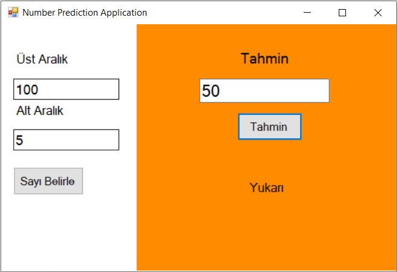
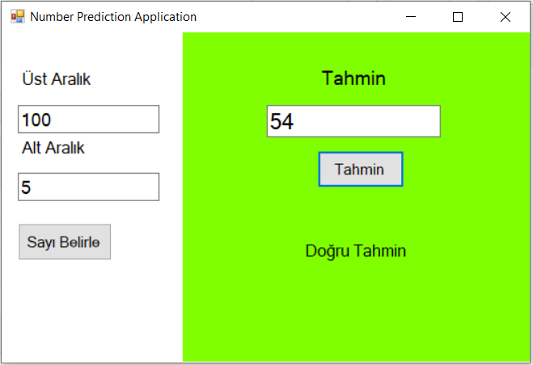

<h1> Number Prediction C# Form Application </h1>
<a href="https://www.youtube.com/watch?v=4usrgdiWgF8">Konu Anlatım Videosu / Lecture Video </b>

Üst ve alt sayıları belirleyip "Sayı Belirle" butonuna basarak tahmin edilecek sayı belirlenir
"Tahmin" butonuna bastığında tahmininizin ne kadar yaklaştığınızı görebilirsiniz

If you need to determine the upper and lower numbers and guess by pressing the "Determine Number" button, the number will be ready.

You can see how close you are to the number you can guess by pressing the "Guess" button
